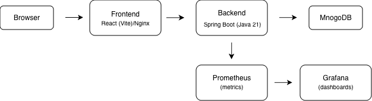
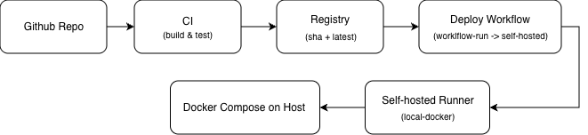
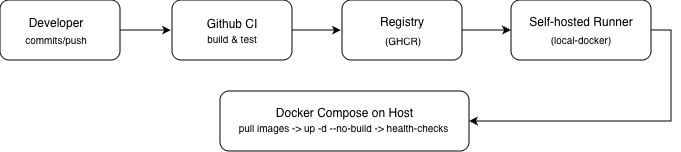

# Medical System

Full‑stack medical management system built with a React (Vite) frontend, Spring Boot backend, and MongoDB, packaged for local Docker and wired with GitHub Actions CI/CD and monitoring.

---

## Table of contents

- [Overview](#overview)
- [Architecture](#architecture)
- [Tech stack](#tech-stack)
- [Project structure](#project-structure)
- [Getting started (Docker)](#getting-started-docker)
- [Local development](#local-development)
- [CI/CD pipeline](#cicd-pipeline)
- [Monitoring & dashboards](#monitoring--dashboards)
- [Configuration & secrets](#configuration--secrets)
- [Troubleshooting](#troubleshooting)

---

## Overview

This repository contains:

- A React (Vite) SPA in `frontend/` for patients, doctors, and admins.
- A Spring Boot (Java 21) API in `backend/` using MongoDB.
- A Docker Compose stack that runs the app + MongoDB + Prometheus + Grafana locally.
- GitHub Actions workflows for CI (build & test) and CD (deploy to a self‑hosted Docker runner).

Key files:

- CI workflow: `.github/workflows/ci.yml`
- Deploy workflow: `.github/workflows/deploy-local-docker.yml`
- Compose stack: `docker-compose.yml`

---

## Architecture

High‑level architecture of the system running via Docker Compose:



- Browser → React (Vite) frontend served by Nginx (in the `frontend` container).
- Frontend → Spring Boot backend (`backend` container).
- Backend → MongoDB database (`mongodb` container).
- Backend exposes metrics to Prometheus, visualized in Grafana.

---

## Tech stack

- **Frontend**: React, Vite, Nginx (for production container image).
- **Backend**: Spring Boot (Java 21), Spring Data MongoDB, Spring Security.
- **Database**: MongoDB official Docker image.
- **Build tools**: Maven (backend), npm (frontend).
- **Container / Orchestration**: Docker, Docker Compose.
- **CI/CD**: GitHub Actions, GitHub Container Registry (GHCR).
- **Observability**: Spring Boot Actuator, Micrometer Prometheus registry, Prometheus, Grafana.

---

## Project structure

Top‑level layout (simplified):

- `backend/` – Spring Boot application (Java 21, Maven).
- `frontend/` – React (Vite) SPA.
- `docker-compose.yml` – local stack (app + MongoDB + monitoring).
- `prometheus/` – Prometheus configuration.
- `grafana/` – Grafana provisioning (datasource + dashboards).
- `docs/diagrams/` – PNG diagrams used in this README.

Backend layout (simplified):

- `backend/src/main/java/com/medicalsystem/...` – controllers, services, repositories, config.
- `backend/src/main/resources/application.properties` – Spring Boot configuration.
- `backend/pom.xml` – backend dependencies and plugins.

Frontend layout (simplified):

- `frontend/src/components/...` – React components for patients, doctors, admin.
- `frontend/src/services/api.js` – API helper for calling the backend.

---

## Getting started (Docker)

### Prerequisites

- Docker Desktop (recommended) or Docker Engine + Docker Compose.

Environment selection is driven by `COMPOSE_ENV`:

- `COMPOSE_ENV=dev` → uses `.env.dev` (development settings).
- default (no `COMPOSE_ENV` or `COMPOSE_ENV=prod`) → uses `.env.prod` (production‑like settings).

### Quick start – development stack

Build backend and frontend locally, then start everything:

```bash
COMPOSE_ENV=dev docker compose up -d --build
```

Once up:

- Frontend: http://localhost:3000
- Backend API: http://localhost:8080/api
- Prometheus: http://localhost:9090
- Grafana: http://localhost:3001

### Quick start – pull and run images (prod‑style)

Assuming CI has already pushed images to GHCR:

```bash
docker compose pull --ignore-pull-failures
docker compose up -d --no-build --remove-orphans
```

This is what the deploy workflow does on the self‑hosted runner.

### Start only monitoring (when app is already running)

```bash
docker compose up -d prometheus grafana node-exporter
```

---

## Local development

### Backend (Spring Boot)

Prerequisite: Java 21 + Maven wrapper (already included).

Run the backend locally:

```bash
cd backend
./mvnw spring-boot:run
# Backend: http://localhost:8080/api
```

Run backend tests:

```bash
cd backend
./mvnw test
```

### Frontend (React + Vite)

Prerequisite: Node.js 20+.

Run the frontend dev server:

```bash
cd frontend
npm ci
npm run dev
# Vite dev server: http://localhost:5173
```

---

## CI/CD pipeline

### Overview

The project uses GitHub Actions to build, test, publish Docker images to GHCR, and then deploy them onto a self‑hosted runner with Docker.

High‑level pipeline:



### Workflows

1. **CI workflow** – `.github/workflows/ci.yml`
   - Runs on pushes and PRs.
   - Builds and tests the backend (with a MongoDB service).
   - Builds the frontend.
   - Builds Docker images for backend and frontend.
   - Pushes images to GitHub Container Registry (GHCR) with tags:
     - `:sha-<commit>`
     - `:latest`

2. **Deploy workflow** – `.github/workflows/deploy-local-docker.yml`
   - Triggered by `workflow_run` after CI completes on `main`.
   - Runs on a **self‑hosted** runner labeled `local-docker` (same machine as Docker).
   - Steps:
     - `docker compose pull --ignore-pull-failures`
     - `docker compose up -d --no-build --remove-orphans`
     - Polls `http://localhost:8080/api/health` until the backend is healthy.

### Self‑hosted runner

To enable deployment from GitHub Actions to your local Docker host:

1. In GitHub repo: **Settings → Actions → Runners**.
2. Add a new runner, install it on your machine.
3. Give it the label `local-docker`.
4. Ensure Docker is installed and the runner has permission to run `docker` / `docker compose`.

---

## Monitoring & dashboards

High‑level deployment + monitoring flow:



### Metrics

- Backend exposes Prometheus metrics at `http://backend:8080/actuator/prometheus` (inside Docker) / `http://localhost:8080/actuator/prometheus` (from host).
- Prometheus scrapes:
  - `backend` service metrics.
  - `node-exporter` (for host metrics, on supported platforms).

### Grafana

- URL: http://localhost:3001
- Default credentials: `admin` / `admin` (Grafana will ask you to change this on first login).
- Dashboards are pre‑provisioned from `grafana/dashboards/medical-system-overview.json`.
  - CPU usage panels (app / host).
  - Memory usage.
  - HTTP request rate and latency for backend APIs.

### Useful commands

```bash
# Validate docker-compose configuration
docker compose config

# Tail logs for key services
docker compose logs backend --tail=200
docker compose logs grafana --tail=200
```

---

## Configuration & secrets

### Environment files

The Compose stack uses env files for configuration:

- `.env.dev` – development settings (e.g. image tags, Mongo URI, ports).
- `.env.prod` – production‑like settings used by CI/CD.

`docker-compose.yml` loads the appropriate file via `env_file` based on `COMPOSE_ENV`.

### GitHub secrets / registry

- `GHCR_OWNER` – owner/namespace for images in GHCR.
- GitHub Actions must have permissions to push to GHCR.
- Other sensitive values (if any) should be stored as GitHub Actions secrets, **not** committed to the repo.

---

## Troubleshooting

- **cadvisor on macOS**: `cadvisor` is removed from the default stack because Docker Desktop on macOS does not expose the required cgroup mount points. Use `node-exporter` + Prometheus instead, or enable cadvisor only on Linux hosts.
- **Prometheus target DOWN**: open the scraped endpoint directly, e.g.:
  ```bash
  curl -sSf http://localhost:8080/actuator/prometheus
  ```
- **Containers keep restarting**:
  - Check logs for the service: `docker compose logs <service> --tail=200`.
  - Verify ports not already in use on the host.
- **Deploy workflow fails**:
  - Confirm the self‑hosted runner is online and labeled `local-docker`.
  - Make sure the runner machine has Docker installed and can run `docker compose` without sudo.

