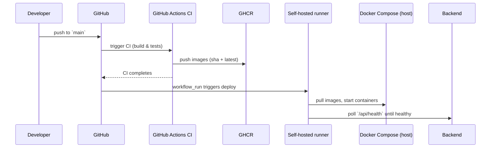

# Medical System (compact)

A compact full-stack medical management demo: React frontend → Spring Boot backend → MongoDB. This README focuses on how to run and the DevOps surface (CI/CD, monitoring, deploy).

Key paths
- CI workflow: .github/workflows/ci.yml
- Deploy workflow: .github/workflows/deploy-local-docker.yml
- Docker Compose: docker-compose.yml

Quick start (Docker)

Prereqs: Docker Desktop (or Docker Engine + Compose)

Dev (build locally):
```bash
COMPOSE_ENV=dev docker compose up -d --build
```

Prod (CI publishes images; deploy pulls without building):
```bash
docker compose pull --ignore-pull-failures
docker compose up -d --no-build --remove-orphans
```

Access
- Frontend: http://localhost:3000
- Backend API: http://localhost:8080/api
- Prometheus: http://localhost:9090
- Grafana: http://localhost:3001

DevOps (overview)
- The repo contains GitHub Actions CI that builds/tests backend and frontend, pushes images to a registry (GHCR), and a deploy workflow that runs on a self-hosted runner labeled `local-docker` to update your local Docker host.
- Deploy workflow does: `docker compose pull` → `docker compose up -d --no-build` → health-checks (`/api/health`). Automatic deploys run only for `main`; manual dispatch remains available.

Self-hosted runner (summary)
- Add a runner in the repository Settings → Actions → Runners and give it label `local-docker`.
- The runner must run on the same machine as Docker to perform the deploy step.

DevOps Documentation (architecture, pipeline, deployment)

Architecture

```mermaid
graph LR
  Browser --> Frontend[React (Vite / Nginx)]
  Frontend --> Backend[Spring Boot (Java 21)]
  Backend --> MongoDB[(MongoDB)]
  Backend --> Prometheus[Prometheus (metrics)]
  Prometheus --> Grafana[Grafana (dashboard)]
```

Pipeline (CI → Publish → CD)

```mermaid
graph LR
  GitHubRepo[GitHub Repo] --> CI[GitHub Actions CI (build / test)]
  CI -->|on main| Publish[Push images to GHCR (sha + latest)]
  Publish --> DeployWorkflow[Deploy workflow (workflow_run)]
  DeployWorkflow --> SelfHosted[Self-hosted runner: local-docker]
  SelfHosted --> DockerCompose[Docker Compose: pull & up --no-build]
```

Deployment flow (sequence)



Monitoring & dashboards
- Prometheus scrapes `backend` at `/actuator/prometheus` and `node-exporter` (if enabled). Grafana is provisioned to load `grafana/dashboards/medical-system-overview.json` with CPU, memory and API latency panels.

Helpful commands
- Validate compose: `docker compose config`
- Quick deploy (pull only):
  ```bash
  docker compose pull && docker compose up -d --no-build
  ```
- Restart Grafana: `docker compose up -d --no-build --force-recreate grafana`

Notes
- Use `COMPOSE_ENV=dev` to select `.env.dev` for local development.
- CI publishes images to GHCR; ensure `GHCR_OWNER` and registry permissions are configured in repository secrets for pushes.

Want images embedded?
- I can render the mermaid diagrams to PNG/SVG and add them to the repo so the README shows visual diagrams directly—shall I generate and commit them?
