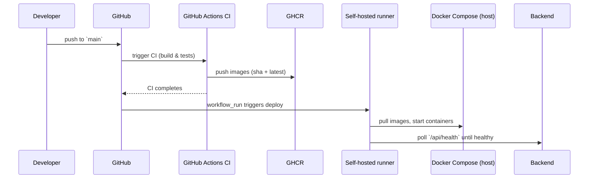

# Medical System

A compact full-stack medical management demo: React frontend → Spring Boot backend → MongoDB. This README focuses on how to run and the DevOps surface (CI/CD, monitoring, deploy).

Key paths
- CI workflow: .github/workflows/ci.yml
- Deploy workflow: .github/workflows/deploy-local-docker.yml
- Docker Compose: docker-compose.yml

Quick start (Docker)

Prereqs: Docker Desktop (or Docker Engine + Compose)

Dev (build locally):
```bash
COMPOSE_ENV=dev docker compose up -d --build
```

Prod (CI publishes images; deploy pulls without building):
```bash
docker compose pull --ignore-pull-failures
docker compose up -d --no-build --remove-orphans
```

Access
- Frontend: http://localhost:3000
- Backend API: http://localhost:8080/api
- Prometheus: http://localhost:9090
- Grafana: http://localhost:3001

Diagrams

Architecture diagram:


Pipeline diagram:


Deployment flow:


Full-Stack & Software Engineering notes

- Frontend: React (Vite) app in `frontend/`. Production build served by Nginx in the Docker image.
- Backend: Spring Boot (Java 21) in `backend/` with layered architecture (controller → service → repository). Uses Spring Security and session-based auth.
- Database: MongoDB (official image). Data volume is `mongo_data` in Compose.

Engineering practices included

- Automated CI: tests + builds run in `.github/workflows/ci.yml`.
- Image versioning: CI tags images by commit SHA and `latest`, pushed to GHCR.
- Infrastructure-as-code: `docker-compose.yml` describes the full local stack (app + monitoring).
- Observability: Micrometer + Actuator expose `/actuator/prometheus` for Prometheus; Grafana dashboards pre-provisioned.
- Health checks: deploy workflow polls `/api/health` to verify readiness.

Run & Development Instructions

1) Prerequisites

- Java 21 (for local backend dev), Node 20+ (for frontend dev), Docker Desktop or Docker Engine + Compose.

2) Run full stack with Docker (dev)

```bash
# build backend & frontend, start all services (dev env values)
COMPOSE_ENV=dev docker compose up -d --build
```

3) Run only monitoring (if apps already running)

```bash
docker compose up -d prometheus grafana node-exporter
```

4) Fast deploy (when CI has published images)

```bash
docker compose pull --ignore-pull-failures
docker compose up -d --no-build --remove-orphans
```

5) Frontend local dev

```bash
cd frontend
npm ci
npm run dev
# open http://localhost:5173
```

6) Backend local dev

```bash
cd backend
./mvnw spring-boot:run
# open http://localhost:8080/api
```

7) Run backend unit tests

```bash
cd backend
./mvnw test
```

8) Grafana credentials & dashboards

- Default admin: `admin` / `admin` — Grafana prompts to change on first login.
- Dashboards are provisioned from [`grafana/dashboards`](grafana/dashboards) and mounted into Grafana via Compose.

Troubleshooting & common issues

- cadvisor on macOS: removed from default compose due to cgroup mount issues. Use `node-exporter` and Prometheus for host metrics on Linux hosts.
- If a service reports DOWN in Prometheus targets, open the endpoint directly (e.g., `curl -sSf http://localhost:8080/actuator/prometheus`).
- To view logs:

```bash
docker compose logs backend --tail=200
docker compose logs grafana --tail=200
```

Configuration & secrets

- `GHCR_OWNER`, image tags and other environment variables are set via `.env.dev` / `.env.prod` and by GitHub Actions secrets for publishing.

CI/CD notes

- The CI workflow builds and tests both services, then the `docker-publish` job pushes images to GHCR.
- The deploy workflow (`.github/workflows/deploy-local-docker.yml`) is triggered by `workflow_run` after CI completes on `main` and runs on a self-hosted runner labeled `local-docker`.

Contributing

- Branch model: feature branches → PR to `develop` / `main` (your team convention).
- Run tests and linters before opening PRs. Keep commits small and focused.

Want rendered images added? Done — diagrams are in `docs/diagrams`. If you'd like higher-fidelity PNGs or alternative layouts, I can regenerate them.


DevOps (overview)
- The repo contains GitHub Actions CI that builds/tests backend and frontend, pushes images to a registry (GHCR), and a deploy workflow that runs on a self-hosted runner labeled `local-docker` to update your local Docker host.
- Deploy workflow does: `docker compose pull` → `docker compose up -d --no-build` → health-checks (`/api/health`). Automatic deploys run only for `main`; manual dispatch remains available.

Self-hosted runner (summary)
- Add a runner in the repository Settings → Actions → Runners and give it label `local-docker`.
- The runner must run on the same machine as Docker to perform the deploy step.

DevOps Documentation (architecture, pipeline, deployment)

Architecture

```mermaid
graph LR
  Browser --> Frontend[React (Vite / Nginx)]
  Frontend --> Backend[Spring Boot (Java 21)]
  Backend --> MongoDB[(MongoDB)]
  Backend --> Prometheus[Prometheus (metrics)]
  Prometheus --> Grafana[Grafana (dashboard)]
```

Pipeline (CI → Publish → CD)

```mermaid
graph LR
  GitHubRepo[GitHub Repo] --> CI[GitHub Actions CI (build / test)]
  CI -->|on main| Publish[Push images to GHCR (sha + latest)]
  Publish --> DeployWorkflow[Deploy workflow (workflow_run)]
  DeployWorkflow --> SelfHosted[Self-hosted runner: local-docker]
  SelfHosted --> DockerCompose[Docker Compose: pull & up --no-build]
```

Deployment flow (sequence)



Monitoring & dashboards
- Prometheus scrapes `backend` at `/actuator/prometheus` and `node-exporter` (if enabled). Grafana is provisioned to load `grafana/dashboards/medical-system-overview.json` with CPU, memory and API latency panels.

Helpful commands
- Validate compose: `docker compose config`
- Quick deploy (pull only):
  ```bash
  docker compose pull && docker compose up -d --no-build
  ```
- Restart Grafana: `docker compose up -d --no-build --force-recreate grafana`

Notes
- Use `COMPOSE_ENV=dev` to select `.env.dev` for local development.
- CI publishes images to GHCR; ensure `GHCR_OWNER` and registry permissions are configured in repository secrets for pushes.

Want images embedded?
- I can render the mermaid diagrams to PNG/SVG and add them to the repo so the README shows visual diagrams directly—shall I generate and commit them?
